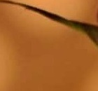
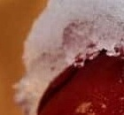

# OpenCV Image Cropping.
Image cropping using OpenCV.
## Contents :


## Test Image used: 
I have used image.jpg that can be found in the repository.


 



## Summary:

```python
#Slicing to crop the image
cropped_image = img[80:280, 150:330]

```

